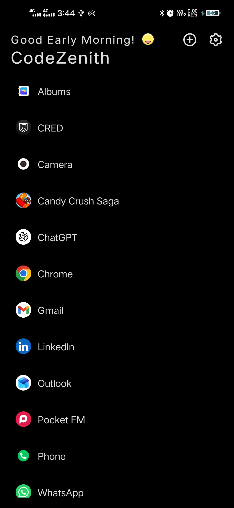
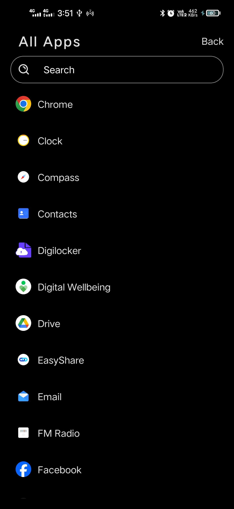
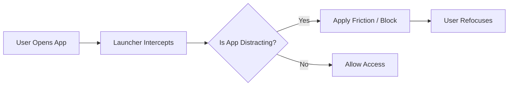

# 🚀 New Tab

### _A Behavior-Driven Minimal Android Launcher_

<p align="center">
    <b>Stop using your phone. Start controlling it.</b>
</p>
<p align="center">
    
    
    
    
</p>

## ⚡ Why New Tab Exists

Smartphones are optimized for: - addiction loops

- infinite scrolling
- constant interruptions

**New Tab flips that model.**

> Instead of giving you more features, it removes them.

## 🎯 What You Get

A **default Android launcher** that: - eliminates visual noise

- reduces unconscious usage
- actively prevents distraction

## 🧠 Core Differentiator

- Most launchers = UI customization
- **New Tab = behavior control layer**

## ✨ Features

### 🧩 Minimal Home Screen

- Only apps you explicitly choose
- Zero clutter
- Zero scrolling grids

### 🧠 Adaptive Focus Mode _(Signature Feature)_

Behavior-aware system that: - detects distraction loops

- tracks app switching patterns
- intervenes in real-time

**Interventions include:** - soft nudges

- delayed app launches
- temporary app blocks

> No dashboards. No stats. Just outcomes.

### ⚙️ Full App Control

- Launch apps
- View system info
- Uninstall instantly

All from one interface.

### 🖐️ Drag & Drop Organization

- Reorder apps instantly
- No complex menus

### 🔒 Double-Tap to Lock

- Kill idle usage instantly
- Break distraction cycles

### 🌗 Distraction-Free UI

- Light / Dark mode
- Optional **text-only mode** (no icons)

### ⚡ System-Level Control

- Overrides Home button
- Always returns to a clean state
- Enforces behavioral consistency

## 🖼️ Visual Preview
### Home Screen UI

### All Apps UI


## 🧬 Philosophy

> **Use data internally. Expose simplicity externally.**

Users don't need analytics.
They need **control**.

## 📱 How It Works



## 🏗️ Tech Stack

- React Native
- TypeScript
- React Navigation
- Async Storage

### Native Android Modules

- Launcher integration
- System settings control
- Screen lock (Device Admin)
- Usage pattern engine

## 🔐 Permissions

| Permission | Why |
| --- | --- |
| Device Admin | Screen lock |
| Battery Optimization Ignore | Keep launcher active |
| Usage Access | Behavior-aware focus system |

## ⚙️ Setup

```bash
git clone https://github.com/pvragul/newtab.git
cd newtab
npm install
npx react-native run-android
```

> Android only (deep system integration required)

## 🧠 Ideal Users

- Developers & builders
- Deep work professionals
- People serious about digital discipline

## 🧭 Not For You If

- You want heavy customization
- You like widgets & flashy UI
- You prefer convenience over control

## 🔮 Roadmap

- AI-based distraction prediction
- Context-aware focus triggers
- Habit reinforcement loops
- Cross-device behavioral sync

## 🤝 Contributing

Contributions are welcome---but aligned with:

> **Less noise. More control.**

## ⭐ Support

If this project resonates:

- Star the repo
- Share it
- Build on top of it

## 📄 License

MIT

## 💬 Final Thought

**New Tab is not a launcher.**
It's a **behavior filter for your digital life.**
